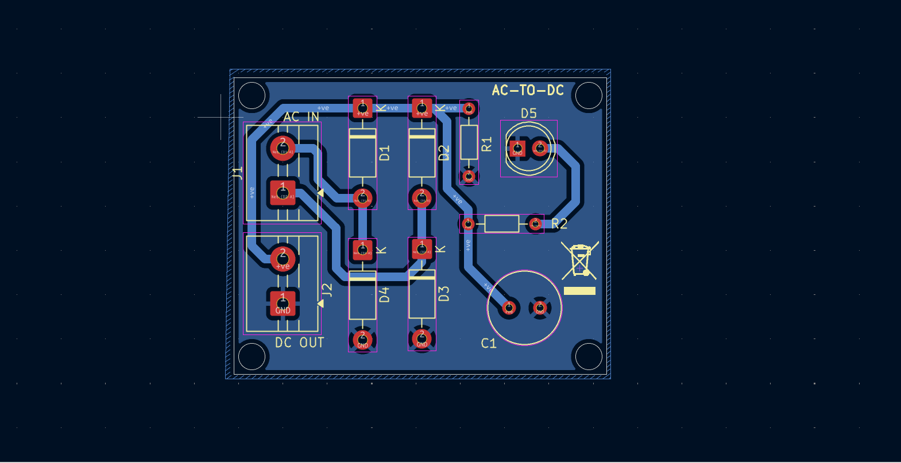

# 12V AC to DC Converter – Single Layer PCB Design

## Project Overview

This project is a **AC to DC converter circuit** designed using **KiCad**, 

The PCB is optimized for simplicity, manufacturability, and beginner-friendly layout.

---

## Electrical Specifications

| Parameter | Value |
|------------|-------|
| Input Voltage | 12V AC |
| Output Voltage | ~16–17V DC (after rectification & filtering) |
| Rectification | Full Bridge Rectifier |
| Filtering | 1000µF Electrolytic Capacitor |
| Indicator | LED with current limiting resistor |
| PCB Type | Single-layer copper |

---

## Circuit Description

### 1. Bridge Rectifier Stage

- **D1, D2, D3, D4 (1N4007)** form a full-wave bridge rectifier.
- Converts 12V AC into pulsating DC.

### 2. Filtering Stage

- **C1 (1000µF)** smoothens the pulsating DC into steady DC voltage.
- Reduces ripple.

### 3. Load & Indicator Stage

- **R1 (10kΩ)** acts as a bleeder resistor.
- **R2 (2.2kΩ) + LED (D5)** provide output power indication.

---

## Design Files

### Schematic

### PCB Layout

### 3D View

---

## PCB Design Highlights

- Single-layer copper routing
- Optimized component placement
- Minimal track crossings
- Compact layout for small board area

---

## Learning Outcomes

- AC to DC rectifier working principle
- Bridge rectifier design
- Capacitor smoothing technique
- Practical single-layer PCB routing skills
- Real-world PCB design constraints

---

**Designed by:** Aniketh M. Nair  
**Tool:** KiCad  
**Date:** 29 Jan 2026

