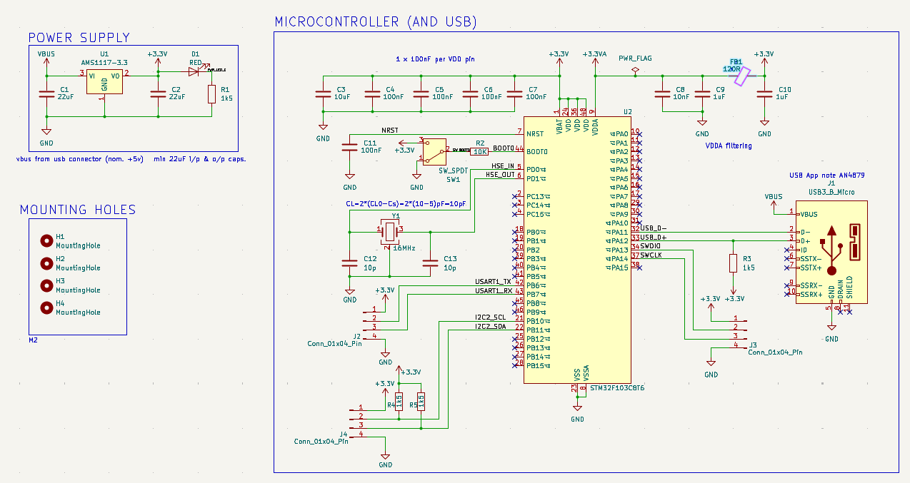
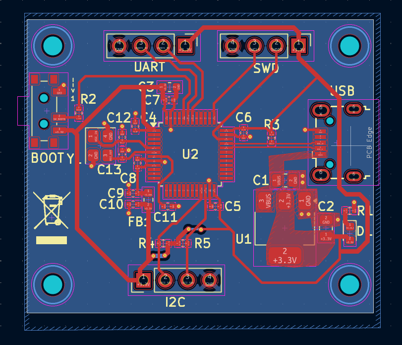
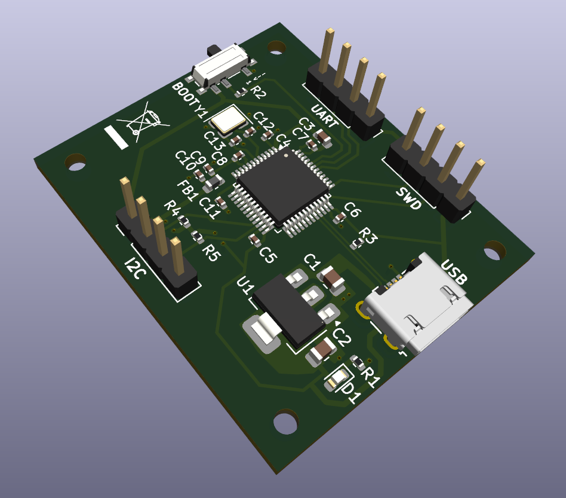
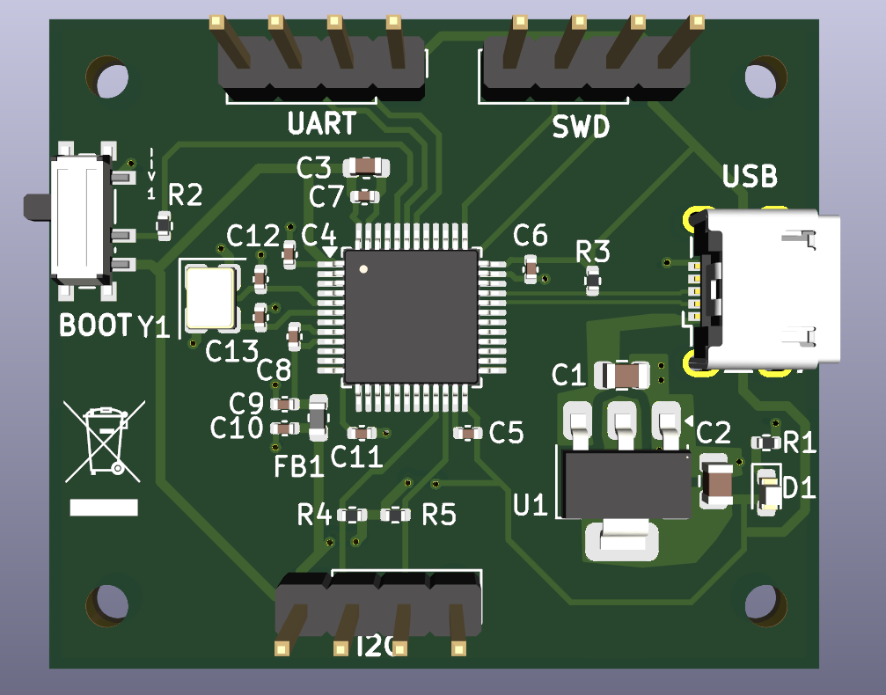

# Cistom STM32 Board with Micro USB2.0

Custom STM32 microcontroller board with USB connectivity designed in KiCad.

## Schematic

## PCB Layout

## 3D Views

## Features
- STM32 MCU
- USB Micro interface
- AMS1117 3.3V regulator
- SWD programming header
- Proper decoupling & VDDA filtering
- Ground plane design

## Project Files
- KiCad schematic & PCB
- Gerber files for fabrication
- PCB layout

## Author
Aniketh 
Feb 2026
