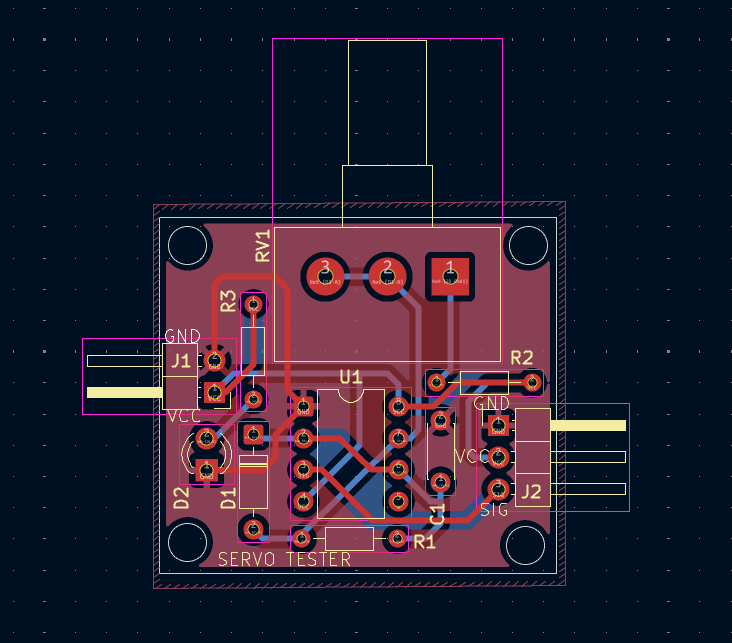
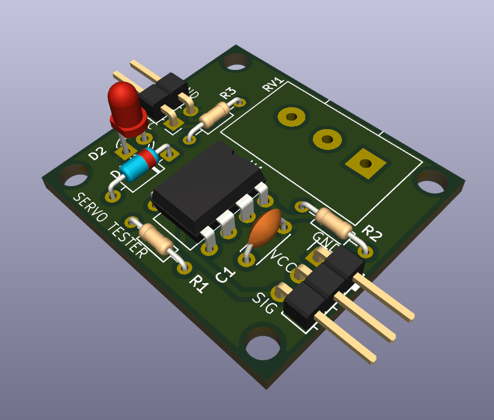

# NE555 Servo Tester – PCB Design

## Project Overview

This project is a **servo motor tester circuit** based on the **NE555 timer IC**, designed using **KiCad**.

The circuit generates a **variable PWM signal (50Hz)** suitable for controlling standard hobby servo motors.  
It allows easy testing of servo motors without using a microcontroller.

---

## Electrical Specifications

| Parameter | Value |
|------------|--------|
| Input Voltage | 5–6V DC |
| Control Signal | PWM |
| PWM Frequency | ~50Hz |
| Controller IC | NE555 Timer |
| Output | Servo signal + Power + GND |
| PCB Type | double-layer |

---

## Circuit Working

The NE555 timer is configured in **astable mode** to generate a PWM signal.

- **RV1 (100k potentiometer)** controls the duty cycle.
- **C1 (22nF)** and resistor network define the PWM frequency.
- The generated PWM output is used to control the servo motor angle.
- LED indicates power presence.

---

## Circuit Description

### Power Section

- Input: 5–6V DC
- LED + resistor used for power indication.

### PWM Generation

- NE555 generates a PWM signal.
- Potentiometer allows manual duty cycle adjustment.
- Output frequency maintained near 50Hz for servo compatibility.

### Servo Output

- 3-pin connector:
  - VCC
  - GND
  - PWM Signal

---

## Design Files

### Schematic

### PCB Layout

### 3D View

---

## PCB Design Highlights

- Compact layout
- Clean routing
- Easy adjustment access
- Standard servo connector footprint
- Single-layer routing

---

## Learning Outcomes

- NE555 timer working
- PWM signal generation
- Servo motor control fundamentals
- Practical analog electronics design

---

**Designed by:** Aniketh  
**Tool:** KiCad  
**Date:** 30 Jan 2026

